# 初来乍到

## 欢迎回家

### Welcome Home！

亲爱的同学，等你好久了！

跨过高考这个门槛，同学们已经成为这所年仅3岁的年轻大学的一员。请时刻牢记我们的校训——"立志 成才 报国 裕民"。并且希望同学们明白，学校的创建，是致力于达成这样一些目标的——服务国家经济社会发展战略，培养科技创新创业人才，提供科技解决方案、发挥思想库作用。创新驱动、转型发展的今天，上科大的全体师生，都肩负着积极投身高等教育改革，共同努力建设一所小规模、高水平、国际化的研究型、创新型大学的重大使命。

在国务院《上海系统推进全面创新改革试验加快建设具有全球影响力的科技创新中心方案》中明确指出："……发挥上海科技大学的体制机制优势，加快物质、生命、信息等领域特色研究机构建设，开展系统材料工程、定制量子材料、干细胞与再生医学、新药发现、抗体药物等特色创新研究，建设科研、教育、创业深度融合的高水平、国际化创新型大学。"在张江建设国家科学中心的时代浪潮之中，上科大扮演着极为重要的角色。

跨过这个门槛，同学们就是上科大历史中的一份子，请时刻牢记，自己的选择和行为将会深刻地影响这所学校未来的发展，各位学生既是学校的参与者，更是学校的创办人，让我们积极迎接即将到来的挑战，与这所学校共同进步，共同成长。希望这份新生手册，能帮助你更顺利地启动人生下一阶段的精彩生活。

最后，送上一句上科大历年欢迎新同学的话语：

欢迎回家！

### 上科大概况

上海科技大学（ShanghaiTech University，简称上科大、ShanghaiTech）是一所由上海市人民政府与中国科学院共同举办、共同建设，由上海市人民政府主管的全日制普通高等学校，2013年9月30日经教育部批准同意正式建立。学校致力于服务国家经济社会发展战略，培养科技创新创业人才，提供科技解决方案及发挥思想库作用，积极投身高等教育改革，努力建设一所小规模、高水平、国际化的研究型、创新型大学。

上科大位于上海—浦东新区—张江高科技园中区—中科院上海浦东科技园内，与中科院上海高等研究院、国家蛋白质科学研究（上海）设施、中科院上海药物所新药创制平台、上海微小卫星工程中心、上海同步辐射光源等国家级科研机构和大科学装置融为一体，与张江高新区的产业界、投资界有机衔接。学校新校园占地约900亩，总建筑面积约70万平方米，校园建设充分体现“学生教师为本，教学科研融合，绿色环保智能”的规划设计理念，已于2015年底基本建成，正逐步投入使用。

上科大以理工科为主，设立物质科学与技术学院、生命科学与技术学院、信息科学与技术学院和创业与管理学院等四个学院，实行大学院制，学院下不设系。学校设立免疫化学研究所和iHuman研究所等两个研究所。

上科大按照1:10–1:12的师生比建设一支1000人规模的专任教师队伍，规划选聘500位常任教授和500位特聘教授。其中，常任教授主要来源于国际著名大学的知名学者和优秀青年学者，实行常任教授制（Tenure System）；特聘教授主要来源于中科院上海分院研究院所的优秀科学家以及国内外著名教授。截至2016年7月，学校已选聘396位专任教师（109位常任教授，287位特聘教授），其中包括3位诺贝尔奖获得者、6位美国国家科学院院士、2位英国皇家学会会士、26位中国科学院院士、3位中国工程院院士、95位国家杰出青年科学基金获得者以及72位国家/外专/青年/上海“千人计划”人才。

上科大培养本科生、硕士研究生、博士研究生以及专业学位研究生，在校学生规模规划为本科生2000名，研究生4000名。2013年学校招收了首届296名中科院联培研究生。2014年学校面向全国9省市招收了首届207名本科生。截至2015年底，学校共有本科生（两届）共504人，研究生（三届）共1055人。

上科大秉持“立志、成才、报国、裕民”的育人理念，致力于培养德才兼备，从事科学发现、高技术创新与新兴产业创业的拔尖人才，成为未来的科学引领者、技术发明者和企业创办者。学校实行书院制，学院、书院分工协作培养人才，其中学院侧重于专业能力的培养，书院侧重于综合素质培养和人格养成。学校实行本科生导师制，为每位本科生配备导师，在学业、生活、职业等多方面为学生提供全方位的指导。学校注重社会创新实践、科研创新实践及产业创新实践，2015年开展了首次本科生暑期社会实践活动，实践地点遍布全国8省/自治区。学校致力于构建国际化的学习环境，为优秀学生提供充足的海外学习交流机会。

上科大瞄准物质科学与技术、生命科学与技术和信息科学与技术的前沿领域同时开展教授个体科研和围绕重大目标的团队科研，推动学科交叉融合、大学与国家级科研机构融合，构建科技进步驱动产业发展的完整创新价值链，针对国家在转型发展过程中所面临的一系列严峻挑战，探索基于科技创新的解决方案。目前，物质、信息、生命、创管学院以及免疫化学研究所、iHuman研究所已制定了学科/平台建设规划，常任教授、科研人员正陆续到位，截至2016年6月已建立98个研究组，科研工作全面开展，高水平科研成果开始涌现。作为张江综合性国家科学中心的核心依托单位，学校将与中科院上海分院等单位合作建设活细胞成像、超强超短激光、自由电子激光等一系列大科学装置，实施一系列重大科学研究项目，为上海加快建设具有全球影响力的科技创新中心做出重要贡献。

上科大积极投身教育全球化，与多所国际一流大学在教师培养、课程共享、学生交换、学术交流、合作科研等方面开展全方位务实合作，并积极拓展与国内一流大学的交流合作关系。目前学校已与加州大学伯克利分校、芝加哥大学、帕多瓦大学签署校级合作协议，与麻省理工学院签署学生培养合作协议，并正在与加州理工学院、牛津大学等学校深入探讨合作事宜。首批32名本科生已于2015年暑期赴加州伯克利、芝大进行课程学习和文化交流;与南加州大学电影学院合作开办的首期电影编剧培训班获得圆满成功。

与此同时，学校致力于逾越科技与产业间的“死亡之谷”，充分发挥自身区位优势，与区域内乃至全球的知名高科技企业在联合研发、联合培养等方面开展实质性合作。目前学校已与博通公司（全球最大无晶圆厂半导体公司之一）达成协议合作开展“无线城市”项目，安进公司（全球最大抗体药物公司之一）已在校园内建立安进亚洲研发中心。

## 加入新生群

在本科生QQ群里，你可以和同学们一起相互了解、共享资源、分享经验，也可以找到一些老师和学长学姐。在熟悉使用学校邮箱之前，重要通知也会通过QQ群发布，记得加入：

shanghaitech-16级本科生群 571949889

新生群仅允许学生本人加入，加入时请注明自己的地区与姓名。也请不要与外校同学分享QQ群号。

## 打包行李

也许你已经习惯了住宿的生活，又或许这是你第一次体验宿舍生活。也许你从家到学校只要骑20分钟车，又或许需要坐过夜的火车。打包行李总是需要花不少精力去做的一件事。值得注意的是，军训所需要的行李与平日宿舍生活所需的行李略有差别，建议打包时做好相应区分，将平日在宿舍所用的物品先行寄存在校园内而不必带去东方绿舟。

### 必备文件、身份证明与档案材料

* 身份证、团员证等身份证件及高中毕业证书的原件及复印件

* 录取通知书原件

* 证件照（为了不在未来四年留下黑照，千万要提前准备好哟）
（备好1寸及2寸至少各一版）

* 户口材料（仅限计划迁户口的同学）

* 你自己

### 宿舍基本生活用品

* 衣物

* 洗漱用品

* 床上用品（可以考虑到校购买）

    * 棉花毯或床垫

    * 床单

    * 枕头

    * 被子

    * 竹席

    * 蚊帐

* 排插（每个床位下配备2个国标壁插，务必购买优质排插以避免安全隐患）

* 台灯（注意购买灯泡的规格、色调，可以考虑到校购买）

### 军训必备用品

* 常用药品、医疗用品（场地亦有医疗配备）

* 日化用品

    * 花露水/清凉油/风油精

    * 防晒霜

    * 驱蚊液

    * 洗衣粉/洗衣液

* 换洗内衣及少量衣物（军训大部分时间穿着作训服，不需要带过多衣物）

* 雨具（军训期间可能会发放雨披，尽量不要携带长柄伞，以免放置不便）

* 水杯（千万不要塑料杯，也尽量摈弃没有外套的玻璃杯，不然在军训的时候当你想喝水的时候，会发现杯子就像刚从火炉里拿出来的一样哦）

* 洗漱用品

* 拖鞋（以及备用的军训用鞋）

* 衣架（军训场地有衣架，但不保证够用）

* 小挂锁（门口有小储物盒，可用小挂锁锁住。也可以只使用自己带锁的行李箱）

* 女生的护理用品（训练强度远达不到要用来当鞋垫的地步）

* 零钱（如果丢了帽子得自己掏钱再买，另外东方绿舟里面有个小超市，适量携带，不宜过多）

* 零食（小超市的价格比较高，可以考虑自带，适量携带，吃不完就很尴尬了）

* 排插与充电器

（东方绿舟部分区域有i-Shanghai免费Wi-Fi热点与ChinaNet热点同时覆盖）

## 报到交通指南

### 铁路抵达

在开学后，你才能获得购买学生票专用的磁条。12306网上订票取票时，需要刷取磁条信息，所以在12306网站购买的学生票无法取出。

但是，在人工售票点持本人身份证、录取通知书是可以购票的。请前往当地火车站售票点，不要到代售点，代售点不可购买新生学生票。

* 上海虹桥：轨道交通 2 号线浦东国际机场方向直达报到班车接驳点【预计用时55min】（金科路地铁站）

* 上海站：

    * 北广场：轨道交通 4 号线内圈方向（紫色的车身线，黄色车身线是 3 号线，不要坐错）到世纪大道站换乘轨道交通 2 号线往浦东国际机场方向直达班车接驳点（金科路地铁站）

    * 南广场：轨道交通 1 号线往莘庄方向到人民广场站换乘轨道交通 2 号线往浦东国际机场方向直达班车接驳点（金科路地铁站）

* 上海南站：轨道交通 1 号线往富锦路方向到人民广场站换乘轨道交通2号线往浦东国际机场方向直达班车接驳点（金科路地铁站）

* 上海西站：轨道交通 11 号线往迪士尼方向（学校离迪士尼没几公里路），到江苏路站换乘轨道交通2号线往浦东国际机场方向直达班车接驳点（金科路地铁站）。

### 飞机抵达

* 虹桥国际机场

    * 1号航站楼：（国内航班位于1号航站楼的只有春秋航空）尽量乘坐机场内部交通抵达2号航站楼，亦可乘坐轨道交通10号线往新江湾城方向到南京东路换乘轨道交通2号线往浦东国际机场方向直达班车接驳点（金科路地铁站）

    * 2号航站楼：轨道交通2号线浦东国际机场方向直达报到班车接驳点（金科路地铁站）

* 浦东国际机场：轨道交通2号线徐泾东方向直达报到班车接驳点（金科路地铁站）或磁悬浮至龙阳路后转乘轨道交通2号线浦东国际机场方向直达报到班车接驳点（金科路地铁站）

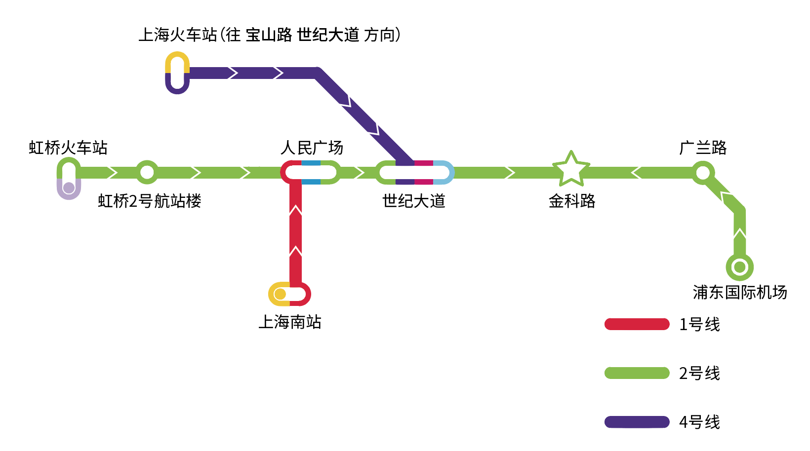

地铁路线示意图，仅列出了出发站、换乘站与终点站（金科路）

提示：

* 由浦东国际机场出发的同学，需乘坐2号线4节编组列车至广兰路站下车，并换乘站台对面的8节编组列车，至金科路站。

* 由上海火车站北广场出发的同学，由于此站3、4号线共用同一站台，请仔细辨认进站列车。4号线列车的车身为白底，中部有紫色的饰带。一部分新车型为3/4号线共用，特征是车身为黑底，中部同时有黄色和紫色的饰带；此类车型请注意车站提示或车身上部的标识，选择4号线乘坐。

### 出租车

上海市的出租车均有统一标识，并配有计价器。下车前请拿好发票。建议不要乘坐非正规或无营运资格的私人车辆。

至环科路199号价格（供参考）：

* 由虹桥枢纽（虹桥火车站、虹桥机场） 140元

* 由上海火车站 85元

* 由上海南站 70元

* 由浦东国际机场 85元

* 由金科路地铁站 15元（1号口一出站就能看到出租车停靠点，但由于需要绕路掉头，在此处乘车车费会多两元左右。亦可由四号口出站后打车）

### 自驾车

由外地自驾车至学校报到的同学请注意，报到当天（即8月29日）为工作日，工作日7时至10时、15时至20时市区12条高架道路及隧桥禁止悬挂外省市机动车号牌的小客车通行。

自驾车设置导航定位点时，请优先设置环科路199号（或上海科技大学-教授公寓等，注意实际地址），若没有相应导航点，可先搜寻金科路/环科路路口。

## 手机卡与银行卡

### 手机卡

和其他学校不同，上科大在新生入学时不配发来自任何运营商的电话卡。同学有自行选择运营商的权利。在报到时，各运营商会前来设摊，提供的手机卡自带校园套餐资费一般优惠程度非常大，且在校外无法获得，需要的同学记得抓住报到时的机会购买新的上海本地手机号。

对于来自外地的同学而言如果已经在当地使用了不计漫游、长途、外地流量的手机号，那么也可以选择在上海直接使用现有的号码，缺点在于外地卡不能在上海做任何的业务办理，包括补卡等。

目前三大运营商在学校室外都有良好的 4G 和 3G 信号。部分运营商在室内信号不佳。当然学校在室内已经基本全范围覆盖 Wi-Fi 了。

### 银行卡

入校后经过拍照等手续，每位同学都会领取到兼具银行卡与校园一卡通功能的上海银行-上海科技大学联名卡。这张卡一共有3种不同的余额账户。

* 储蓄账户：就是普通的活期储蓄存款，可用于网银等支付用途（需自行前往上行网点开通网银业务）；

* 电子现金账户：用于银联的离线闪付（非 Apple Pay 所用的云闪付）。大部分POS机与校外部分自动售货机支持，需要注意的是存入电子现金账户的圈存余额一旦存入后就无法转入储蓄账户或者提现；

* 校园一卡通账户：用于校内消费，如食堂就餐等，也属于圈存性质，可以使用现金充值或者储蓄账户余额转存。（自助终端：银行服务——银校转账）

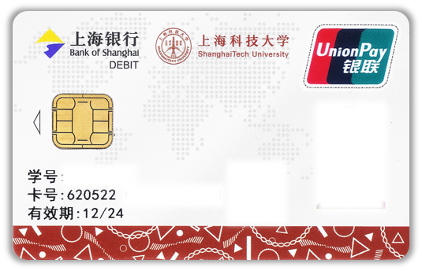

由于上海大部分生活消费都能使用支付宝（不管是饿了么叫外卖还是便利店消费）或者网银（如京东），现金需求一般不大。海科路校区目前有中国建设银行与上海银行的自助存取款一体机，其他银行发行的银行卡在进行业务操作时可能会收取跨行手续费。

## 户籍迁移

外地户籍新生可自愿选择是否将本人常住户口由现户口所在地迁至上海市集体户口，上海市户籍新生不迁户口。外地户籍新生若选择户口迁移，凭录取通知书原件到现户口所在地派出所办理户口迁移证。

注意:相关迁移说明请以学校发布的[户口迁移告知单](http://asa.shanghaitech.edu.cn/fresh/more.asp?id=2)为准。

# 学在科大

## 通识中心·四大学院

上科大目前有物质、生命、信息与创管四大学院，另设有通识教学中心。每位同学入校时都会依照所填志愿进入对应的学院。创管学院不招收本科生，但开设了种类繁多的创新创业课程与金融课程。通识教学中心则主要负责数学课程、体育课程、语言类课程、文明通论系列课程以及人文艺术社科类通识选修课的开设。

### 物质科学与技术学院 SPST

院长：杨培东

上海科技大学物质科学与技术学院依托中科院优秀人才团队，利用上海周边国家实验室一流的科研设施集聚世界领先的师资和学生。我们以打造具有国际水准的材料、能源和环境领域原创性研究与教育中心为目标，注重基础和交叉学科建设，鼓励学术自由与创新，鼓励基于基础理论的大胆的原创想法，鼓励交叉合作和技术转换，并将积极为相关技术的产业化提供原创思想和解决方案。

物质学院细分为系统材料学、光子与凝聚态物理、材料生物学三个研究部，这三个部门将通过推进材料科学领域的基础研究来应对全球能源与环境的挑战；通过发展实验和理论方法，在不同时间与空间尺度条件下设计、发现以及理解新材料及有关现象；通过不同领域之间的交叉合作，寻求材料科学研究的突破，培养新一代材料、化学和物理方面的科学家。

截至到2015年12月底，全院共有学生599名，其中本科生183名，研究生416名。专任教师139人，其中常任教授17人，中科院特聘教授122人。物质学院从2013年至2015年已经购置了1.4亿的科研设备，将建设一个联盟（上海科技大学-湾区联盟），三个研究部和相关实验中心。学院成立至今国内外的学术交流活动也相继展开，2015年度，物质学院有30多场海内外的学术报告，同时在6月份举办了第一届”STAR（ShanghaiTech Advances in Research）”国际会议。上科大物质学院是正在成长的全新学院，但这里名师汇集，这里充满了挑战。

[物质科学与技术学院网站](http://spst.shanghaitech.edu.cn/)

### 生命科学与技术学院 SLST

院长：林海帆

执行院长：吴家睿

上海科技大学生命科学与技术学院依托中国科学院上海地区生命科学领域的优秀人才队伍和国际一流的研究设备，利用张江地区的多学科研究力量和生物医药研发优势，打造一所达到国际高水准的研究型学院。学院将积极探索教学、科研、转化三者相结合的发展模式，培养适应未来生命科学发展的高端研究人才；适应生物技术行业快速扩张的优秀创业人才；以及满足健康医学需求的新型技术人才。

学院将根据生命科学的热点和前沿设置相应的教学单元和研究单元，鼓励不同学科之间的交叉，强调基础研究与应用研究紧密整合的转化型研究模式，注重教学与科研的相互融合。目前计划在蛋白质科学与生物技术、系统生物学与转化医学、干细胞生物学与再生医学、定量生物学与分子影像学、化学生物学与创新药物等方面开展教学与科研工作。

在师资建设方面，学院将以青年优秀人才为主，强调教学与科研能力并重，专职与兼职教师协调发展，打造一支勇于创新、富有激情，结构合理的人才梯队。

在本科生培养过程中，学院将为学生打下坚实的数理化基础，使学生掌握生命科学的基础知识与前沿动态，并在此基础上培养学生宽阔的多学科交叉视野。从大学二年级开始，鼓励学生涉足实践型、研究型训练，培养良好的技术知识和操作能力，并为优秀学生提供参与高层次研讨活动的机会。通过小组讨论以及教师与学生的互动，培养学生的学术交流能力，引导学生进行开放性思考，强化学生的理解与批判能力。

在研究生的培养过程中，学院将着重培养学生成为一名成功的创新型研究人才，使学生具备知识获取和学术鉴别的能力，具备学术交流和学术创新的能力，能以坚实的生命科学专业和宽广的相关学科知识技能，探索生命科学领域中的重要科学技术问题。在整个培养过程中，学生将获得科研经验丰富的导师的悉心指导。学院的研究生还将获得如何进行专业研究报告、如何撰写待发表的优秀论文、以及如何完成有效的教学任务的训练。

学院同样热烈欢迎其他非生命科学学院的同学选修生命科学的课程。对基本生物学原理的理解能够使我们更好地认识生命和人类自身。同时，对生命过程的了解将提升我们对这个人类赖以生存的星球的认识，并学会欣赏它的多样性和独特性。

[生命科学与技术学院网站](http://slst.shanghaitech.edu.cn/)

### 信息科学与技术学院 SIST

院长：王雪红

执行院长：马毅

信息科学与技术学院（School of Information Science and Technology）致力于聚集和成就未来信息科学领域的学术大师，培养和团结信息技术及相关应用领域的创新人才和创业领袖，力争在信息科学与技术的重点领域取得突破性和前沿性的创新成果，实现新科学和新技术的快速转化和产业化，孕育并服务于信息通信领域的国际领军高科技企业。

本学院的科研工作将面向全球重大挑战和国家战略需求，充分发挥长三角地区在人才、资金、科技产业和政策等方面的优势，吸引和聚集一批具有国际声誉的学术带头人来建立国际领先的关键技术研究实验室，通过与国内外顶尖大学、科研机构和高科技企业通力协作，掌握并引导国际信息科技的发展趋势，集中力量攻克核心技术难题，踊跃承担和支撑国家重大科研任务。

本学院的教学工作将采用导师负责制，面向最前沿、最尖端的信息科技研究领域及其迅猛发展趋势，积极开展与国际顶尖大学、科研机构和高科技企业的合作与交流，为学生提供个性化教学和培养计划，开设先进实用的专业课程，提供国际合作的本硕双学位计划，强化结合实际的企业实习和社会实践活动，注重培养学生的国际视野、团队精神、领导才能、创新和创业能力。

本学院将以我们的毕业生之科技和创新成就为荣耀和成功标志，真正成为科学领导者、技术创新者与未来革新企业创办者的乐园和摇篮。

[信息科学与技术学院网站](http://sist.shanghaitech.edu.cn/)

信息学院主办国际学术会议：[SSIST](http://ssist2016.shanghaitech.edu.cn/)、[SWEDCS](http://swedcs2016.shanghaitech.edu.cn/)

### 创业与管理学院 SEM

院长：李玫

创业与管理学院（简称：创管学院）是为实现上海科技大学 “培养创新创业人才”的办学使命而搭建的教育服务平台。

我们的目标是鼓励和激发我校每一位学生与生俱来的好奇心和求知欲，提升他们的创造力和创造性信心。这里不仅教授学生批判性思维与技能，帮助学生学习如何创新；我们还将汇集设计思维、艺术及其他创新工具，为学生提供跨学科领域的形式多样的课程。对于那些拥有创业梦想的学生，我们也会提供诸如商业机会识别、创业融资以及公司运营等一系列的创业基础课程。

创管学院将定期举办各类活动，与国内外风险投资机构、成功的创业家（包括在大学任教的科学家）、律师以及企业高管合作，为学生们打造导师计划并提供实习机会。

我们的活动旨在不断向学生灌输社会责任感。我们希望学生们不仅以自己的热情和能力“办好事”、“把事办好”，还要努力解决当前社会所关注的、具有极大挑战的社会问题，如照料老人、城市交通拥堵、教育问题等。

在这里，你们将感受到不同于一般传统商学院的学习氛围：小班授课（每班20至30个学生）以及高度强调互动体验式学习的授课形式。我们不支持老师一味灌输知识的授课方式，充分讨论、互动和实践才是我们坚持的课堂氛围和教学理念。我们的教授团队来自世界各地，其中不乏在加州大学伯克利分校、哈佛大学、斯坦福大学等世界著名高等院校执教的优秀教师。“

创管学院致力于让上海科技大学的每一位学生在学成离校之时，都能具备实现其梦想所需的能力和必备的核心技能，无论他们的梦想是成为诺贝尔奖获得者、自主创业的企业家，还是服务于社会的公务人员。

上海科技大学创业与管理学院热切期待着你们的到来！

[创业与管理学院网站](http://sem.shanghaitech.edu.cn/)

## 规划前程

新学期伊始，相信很多同学尚未有比较明确的前途安排，但对于大家而言，提前掌握好自己的前途规划，提前做好设计和准备，是非常有必要的。

### 明确培养方案

每个学院的各个专业都有各自不同的培养方案，其中规定了专业必修课、专业选修课、跨专业基础课、通识课等各个模块的学分要求，是每位同学进行学业规划以及选课时的重要参考，培养方案一般可以在[教学事务处](http://asa.shanghaitech.edu.cn/teaching.asp?tid=18)或各学院网站查阅到，若有更新，各个学院负责教学的老师会以其他方式告知。

### 与导师经常沟通

你的导师一般都具有深厚的学术背景，能在专业领域的学习上给予你十分宝贵的经验，帮助你进行专业领域学习的规划。如有可能，去导师的实验室参观一下，认识一些导师课题组的研究生学长学姐，建立沟通与联系，能获得不少有用的学业或生活经验。具有竞赛经验的同学，也可以尝试参与导师课题组的科研工作，当然，不必局限于自己的导师，完全可以邮件联系其他导师询问情况。

总之，导师手册是大家手中重要的参考资料，学校的导师教授们也是大家前途规划的重要指导。不过，俗话说：师傅领进门，修行在个人。积极与导师沟通，积极参与各项学术科研才能把导师的作用发挥到极致。

### GPA

对于有读研意愿的同学来说，GPA是反映你大学学术水平的一个关键指标。具体的成绩评定规定，请参阅[上海科技大学课程考核及成绩管理办法（试行） - 教学与学生事务处](http://asa.shanghaitech.edu.cn/teaching_detail.asp?id=38)。

### 英语

上科大并不将通过四六级考核作为毕业评判标准。新生入学时会进行英语分级测试，往年的测评系统为EFSET，依据系统给出的CEFR等级进行分班。英语分级测试的目的是让大家进入适合的英语学习氛围进行学习，提前刷题没有什么意义。如果有国际交流或留学深造打算，暑期可以寻找社会培训机构对英语能力进行加强。

考虑到国际学术界的现状，以及上科大的英文授课情况，英语在上科大生活中属于具有极强基础的需求技能，掌握好英语的沟通交流能力、书写能力，学会与教授口头或书面交流仍是必不可少的需要。

### 参与科创竞赛或项目

上科大与中科院的深厚联系使得同学们能够享有许多参与科创竞赛或者项目的机会，例如与中科院上海微小卫星工程中心联合举办的微小卫星科技创新竞赛，以及上海高等研究院每年的大学生创新实践训练计划等。有意参与的同学要记得留意自己的邮箱，以免错过良机。

除了学校组织参与的科创竞赛或项目外，学校也鼓励同学们自己组队参加竞赛，并视情况调配资源予以支持。例如OM（头脑奥林匹克）、MCM（美国大学生数学建模比赛）、iGEM（国际遗传工程机器设计竞赛）、国内各大高校的ACM交流赛、黑客马拉松等竞赛或活动，主要都是由同学自己组队与报名参赛的。

学校也正在筹备学生科创中心的建设进展，学生会也先期提供了学生科创中心工作室（科研楼204）开放给全体同学，有意向参与的同学可以注意积极留意相关信息。

## 学术诚信

在上科大，学术诚信可以说是至关重要的原则性问题，常见的学术不端行为包括但不限于：

* 作业抄袭或超出允许范围的交流

* 考试作弊

* 伪造变造实验数据

* 剽窃或部分剽窃论文内容

学术诚信是每位同学学业生涯中最为重要的一环，无论是作业抄袭还是考试作弊，无所谓大小轻重，皆是对自己和其他同学努力付出的不敬，也是对规章制度的无视与违逆。

每个学期，学校都会有不同的科目组织严查作业作弊等学术不端行为，一经发现，轻则单科取消成绩，重则开除学籍，有的学院还规定了对于有学术不端行为记录的学生，将不会再有资格获得任何学院层面负责推荐的奖励以及任何有竞争的学习机会。

鼓励大家在日常学习中了解一些学术规范，希望大家不要误入歧途，以免犯下后悔莫及的错误。

## 暑期预习

其实高考完的这个暑假，最主要的还是尽情玩耍。当然，适当为大学的学习生活做好一些准备是有益无害的。

在网易公开课等平台上，有许多名校公开课，可以对高等数学/数学分析、普通物理、普通化学等课程进行提前的熟悉与了解。

对于没有编程基础的同学，可以在Codecademy、计蒜客或是edX等平台上学习以Python 3为主要编程语言的一些入门性课程。

## 图信中心

学校图书馆为上海图书馆分馆，可以通过图书馆前台借阅上海图书馆其他馆址的图书。

图信中心也提供大量电子学术资源，如正版软件、期刊数据库等。在[图书馆](http://library.shanghaitech.edu.cn/library_more/1/1.html)可以找到更多相关的信息。

## 学习经验

这里是来自心理协会友情提供的部分学习经验介绍，更多文本将在开学后分发给大家。

### 关于普通化学I学习的一点建议

#### 理论课

普化I是米启兮老师和宁志军老师一起教的。两位老师的专业水平都很高，上课也会用一些模型之类的来帮助同学们理解。也许是因为教的内容太抽象吧，比如薛定谔方程、波函数、分子轨道之类的，大家理解起来还是比较困难的。在这里顺便给学过化学竞赛的同学们提个醒，竞赛中也许会提前讲到这些内容，不过竞赛只是告诉我们这些是什么，但普化1告诉我们的是这些为什么是这样的。如果上课时有听不懂的内容，可以直接去问老师和助教，发邮件询问也可以。另外还可以向大佬们寻求帮助（至于哪些同学是大佬大家心里已经都有数了吧）。如果想提前预习的话可以看一看网易上MIT的化学原理。

#### 习题课

习题课主要是讲一讲作业，然后对上课的内容做一些拓展。千万不要划水！！！有时候你也许会学到比上课讲的还有用的知识。

#### 实验课

实验课的内容应该算是最有趣的了。学校提供的都是最先（ang）进（gui）的实验设备，每次实验应该都能看到较为满意的结果。不过还是要提醒一句，不要因为求快就在上课前提前做，不然的话会发生一些你自己不知道的副反应，最后的产率……（别问我是怎么知道的）

### 普通物理新生学习指导

#### 理论课

##### 过渡

高中的物理教学是老师快速给出公式，然后通过大量练习来加深对公式应用的掌握。而大学物理教学则恰好相反：教授将课堂的大部分时间放在了公式的推导上和讲解各公式的联系上，而相应的练习只有每两周一次的数道家庭作业和每周四十五分钟的习题课习题课习题课【注意理解我为什么要打三遍】。

##### 教材

再来说说教材《费曼物理学讲义》，这本书画风清奇，私以为不是很适合基础薄弱的同学，建议辅助一本传统的普物教材，否则易产生物理就是各种神奇猜想的错觉。相反，对于参加过竞赛或者物理基础较好的同学，这本书完整读完，会纠正"重刷题不重推导”的遗风，并带来很多全新的想法。

##### 教师

可要好好珍惜你们的物理老师呀：看似高冷实际机智可爱的薛薛。去年我无论多天真的问题都到了非常详细的解答【有些问题问完我自己都被蠢哭了】，即使有些他当时没有把握，也定然会回去再思忖一番然后给出合理的解释。所以有了奇怪想法，那就问吧；没有理解推导，那就问吧；不服习题的解答，那也问吧。

#### 实验课

普物实验很有意思，但实验报告的书写的确麻烦。所以至少不要陷入两个极端：连实验报告的必要组成部分都没写完整；纯粹为了追求更高的分数在实验报告上无休止的抄写很多自己完全不懂的理论。

#### 多余的话

记得去年这时候，朋友圈中流转着这样的一句话"同样是在名校里念高中，对于小部分人来说，高中是他们巅峰的开始，而对于大部分人来说，高中是他们巅峰的结束。"“巅峰”什么的都无所谓，只是希望，未来每每仰望夜空中Thomson电子模型时，还都能看见那个充满浪漫情怀和理性精神的自己，像火把一样，斗胆照亮神秘而不可知的黑暗，弱小却坚韧，如此叛逆。

最后，致所有物理系同学：学好数学！学好数学！学好数学！

### 给信息学院新生们的一封信

致所有信息学院的新生：

今年有一半新生都选择了信息学院，选择了这个优秀的家庭，所以我的同学钦定我来写一个新生指南的时候我是紧张的，我要一半的新生交流！我实在是不知道我一个信息学院的普通学生，怎么就来给你们写这个了呢。而我又实在不擅长作文，干脆写了个书信体，权当给你们唠嗑吧。

很高兴你们选择了信息学院，也恭喜你们顺利地度过了高考。但是我想说的第一件事就是，请在尽可能短的时间内忘记你所接受过的所有教育。我没说错。中国的学生，花费十几年来做练习，找答案，低头服从，but this is not how this world works. 希望你们学会不服从，学会发出自己的声音。上科大有很多人，但是我们保证每个人的声音都会得到尊重，所以我们需要你们发出你们的声音。你们在想什么，你们需要什么？这个世界需要你们的声音，信息学院需要你们的声音。

你也许觉得这很缥缈，因为你们几乎没有尝试过说出自己的想法。中国的学生不被鼓励发出自己的声音。我可以给你们指出一条根明确的道路，邮件。去给你的导师发邮件、给教授发邮件、给authority发邮件，任何方面的任何问题都可以，去表达你们自己。信息学院的老师回复邮件都很及时的。

或许相比邮件你更喜欢热闹的交流方式，那请不要错过每周的Coffee Hour。在这里信息学院的教授、研究生、本科生齐聚一堂，吃、喝、玩、聊。这里有零食饮料，这里有一切。从健身计划到研究方向，我们无所不谈。希望你们来参与，来发出你们自己的声音，自己的看法。或许，那就是改变世界的看法。

说完了学会发声，你们需要学会思考，否则会变成键盘侠（手动微笑）。学着做一个思考的人而不是重复机器。不要以为进了大学就轻松了，至少信息学院不是这样。大学不会有人给你们安排日程，安排时间也是一种能力，你们要去思考你们的时间安排了。是不是要参加社团？是不是要谈恋爱？亦或者，思考一下你们的未来，你想做什么？VR？数据挖掘？还是其他的？或者哪怕只是思考奥里雷亚诺的身世。我想说的是，请保证你们时时刻刻都在思考，因为信息学院是一个需要思考的地方。

哦，对了，无论你们觉得你们有多忙，看看书（因为你们会变的更忙）。无所谓你们看什么，都会拓宽你们的视野。经典小说？科幻小说？（欢迎小伙伴们到我这里来交流科幻小说）学术著作？《他改变了中国》？无所谓！

快写完了回头一看，发现我说了不少问题，却没有给你们一个方案。但是你们很快就会发现，之前的教育向你们灌输的所谓"一个答案"的论点是几乎无用的。你们很快会发现一个问题会有很多答案，而走哪一条路完全是看你们的选择。我做的只能是告诉你们“不只有一个答案”，记住，选择权永远在自己手上。

我不知道我这么写是不是看起来有点不接地气，我说过我不善文笔。但是我能保证，这是我在一年内获得的最多的感悟。我所说的，一定是我感受最深的，或者最遗憾的（多看书、多看书、多看书），希望你们能有所体悟吧。

更多的也没有了，非常微小的工作。

谢谢。

### 生导小贴士

亲，当你看到这段文字的时候就意味着生命科学导论即将开始啦！无论之前你听说这门课是水多还是干货多，作为过来人都希望你们能够好好对待它，毕竟内容还是非常有意义的！

首先，生命科学导论是门什么样的课呢？每周2课时的理论课与1课时的讨论课也许不会觉得太多，但是背后是需要付出很大的努力的（如果你真的想从中收获些什么的话）。生命科学导论是所有学院所有专业的必修课，所以还是蛮重要的哦~之前这门课是没有期末笔试的，据说从你们这届开始分了AB两个班就有了呢~（偷笑）但是目前具体形式未知，毕竟学校在之前的教学中会收获经验，每年的课程结构与安排都会做一定的调整。

关于生导理论课，高考考了生物的同学会觉得每节课一开始的内容比较基础，但事实上课程主题介绍的都是前沿内容，新论文多，建议认真对待。高考不考生物的同学建议自行复习一下会考内容，跟上大部队的节奏呐~总之，千万不要当做水课看！！！！！！

关于生导讨论课，绝对比做普通生物练习有趣多了，从某种程度上来说学到的也比纯做题多。形式为每次理论课结束统一确定主题，各班内部分小组，讨论后确定各组观点，每周制作PPT进行演讲。同时每个人每周都要围绕主题上交一篇1000字以上的报告。对于那些没有拖延症的孩纸们，不建议提前根据上届PPT写报告，因为主题是根据时事更新的，偶尔老师也会有已经确定主题然后临时变卦的可能。另外，论文文献与资料查找的过程是最辛苦的也是最有收获的，建议使用的平台是PubMed，不建议用中国知网，因为针对性不强、要收费而且水平不高→_→。。

尽管看英文文献一开始会比较吃力，但这是诸位都必须要经历的过程呐~

关于生导课考勤，之前上课是有几次随机点名抽查的，据说以后会换成随堂quiz考勤哦~实在有事不能去的记得在课前递上请假条！

最后希望大家能在这门课中获得灵感，找到自己未来努力的方向。

祝好

# 科大生活

## 认识书院

书院是同学们创造自己文化、打造自己活动的地方。学生组织、文艺汇演、体育赛事、社团活动、导师研讨会、科研设施参观、艺术展览福利……学业以外，书院这个空间充满着无限的可能。

## 学生社团

   上科大当前有诸多学生社团，这些社团也将在开学逐步与大家见面，积极参与社团活动也是丰富的大学生活的一部分。这里有部分社团的介绍，其他社团的负责人可能深陷deadline之中无法抽身来写介绍。

   现有社团的不完全名录：

AI读书会、Lavida Lab生物社（生命科学及相关科创比赛）、骑行社、小世界社（模型）、Icon & Font社团（平面设计）、网球社、SK8滑板社、数学讨论社、白科技社、舞蹈队、手工社、STG社（棋牌桌游、电子竞技）、MCM社（数学建模比赛）、物理社、DIY创意社、风行者轮滑社、记者团、分身·剧社、ACM社、Eden文学社、Geek Pie（网络开发、创客活动）、摄影俱乐部、沪语协会、综合体育社、07社（绘画）、志愿者协会、音乐社、推理社、漫研社、eMotiv工作室（微电影、视频）、礼仪队、FiTech健身社、国风民族文化社、城市定向社、足球社、DIOM科创社（头脑奥林匹克）、赛智社（创业竞赛）、辩论社、羽毛球协会、TikTech街舞社、心理协会

[以下内容不定期更新]

### eMotiV 工作室 （原微电影工作室）

eMotiV Studio 致力于学校内各种微电影，短视频的制作，现在已经开通优酷频道和 YouTube Channel。最近发布了校园开放日短片《三百五十分之一》。在这里有许多对电影剧本，镜头，后期感兴趣的小伙伴们。

社团邮箱: [club-emotivstudio@shanghaitech.edu.cn](mailto:club-emotivstudio@shanghaitech.edu.cn)

优酷：[http://i.youku.com/emotiv](http://i.youku.com/emotiv)

YouTube：[https://www.youtube.com/channel/UCennu2W7UY16pVVCl6ZSTCQ](https://www.youtube.com/channel/UCennu2W7UY16pVVCl6ZSTCQ)

### 07社

07社由一群上科大的美术爱好者组成的艺术类社团。社团成员可以在画室内自由创作，社团还会不定期地组织参加画展、对新手开展教学。

### SK8滑板社

Skateboarding Club由上科大的板仔们建立，社团提供滑板教学，引领校园内滑板代步的风潮，更有tricks交流切磋。社团将滑板的街头文化带入校园，组织滑板刷街，涂鸦等活动。

### Icon & Font社

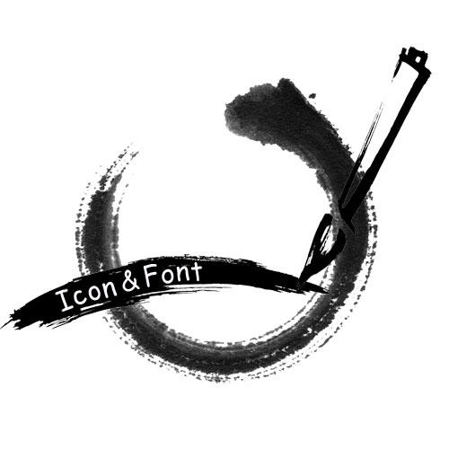

Icon & Font社团是由上科大的图标与字体设计爱好者组成的艺术类社团。社团提供AI、PS等设计类软件教学，以及设计理念的讲座等。让社员学会并有机会设计并拥有属于自己的一套字体和代表图标。

### 漫研社

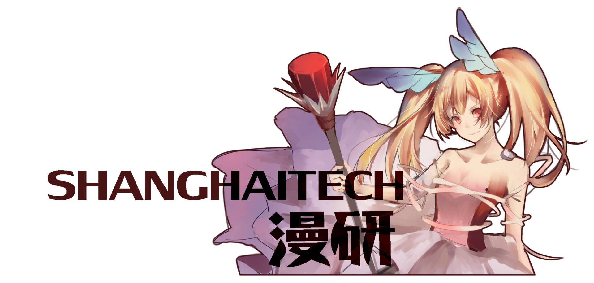

漫研社是由上科大的ACG爱好者们组成的艺术类社团。社团标语为"向更多人传递ACG文化的美好"。社团以ACG文化为主题开展各种形式的活动，常规活动有动画放映会、ACG舞蹈排演、Anisong翻唱、绘画创作、偶像研究等等。

社团邮箱: [club-anime@shanghaitech.edu.cn](mailto:club-anime@shanghaitech.edu.cn)

### Geek Pie

我们是 Geek Pie ，一个非典高校的非典型人类聚集群。我们爱 Coding 也爱 Hacking ，爱 Creating 也爱 Sleeping 。我们致力于开源共享与开发，创意创造与极客风尚。我们不是纯粹的学生组织，我们只是纯粹的 hacker，我们以常规活动为载体，却也致力于建立以项目小组为核心，这里是大家的自留地，也是创意的迸发点。

官方网站：[https://www.geekpie.org/](https://www.geekpie.org)

GitHub：[https://github.com/ShanghaitechGeekPie](https://github.com/ShanghaitechGeekPie)

部分作品：

* 活动成就签到系统：[https://grade.geekpie.org](https://grade.geekpie.org)

* CourseBench 评课社区：[https://www.coursebench.net](https://www.coursebench.net)

* 开源镜像站：[https://mirrors.geekpie.org](https://mirrors.geekpie.org)

* WikiShanghaitech（维护中）：[https://wiki.geekpie.org](https://wiki.geekpie.org)

* 则安的小站：[http://public.zhouzean.tk](http://public.zhouzean.tk)

* 新·信息科学与技术学院官方网站（准备上线中）

### 骑行社

上海科技大学骑行社是由骑行爱好者们所组成的体育类社团。社团不定期组织中短途骑行，并提供义务修车服务。

### 分身·剧社

到了新环境，想改变一下自己的形象？

装文艺、装淑女、装高冷、装逼......你知道如何举动能让人更加信服吗？

来戏剧社吧！我们给你站上舞台，孕育分身的机会！

我们都只能过一种人生，却可以通过表演，抑或欣赏表演，窥探、体会别人的人生。崇尚科学，也欣赏艺术。你的分身，何尝不是你。

### Eden文学社

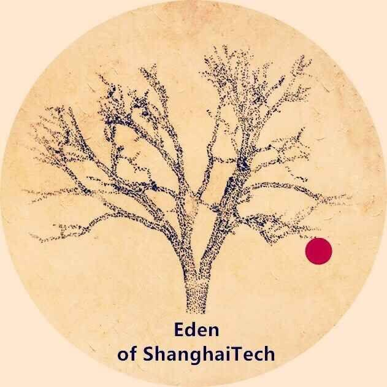

谁说理工生不浪漫？谁说理工生不诗意？

文学社给热爱文学的人一个交流的地方，给想要接触文学的人一个可及的平台。让这所理工科学校增添一些文艺的气质。

文学社主要活动有：每月一期的《书院NEWS》，内容涉及采访、热点事件、杂谈随想还有近期学校的讲座、学生活动等。每周的莎士比亚读书会，复旦大学的博士生陆建松作为读书会的指导老师，让同学们在阅读剧本的同时感受经典。以及不定期举办征稿文大赛。

欢迎有兴趣的同学加入我们!

### 跆拳道社

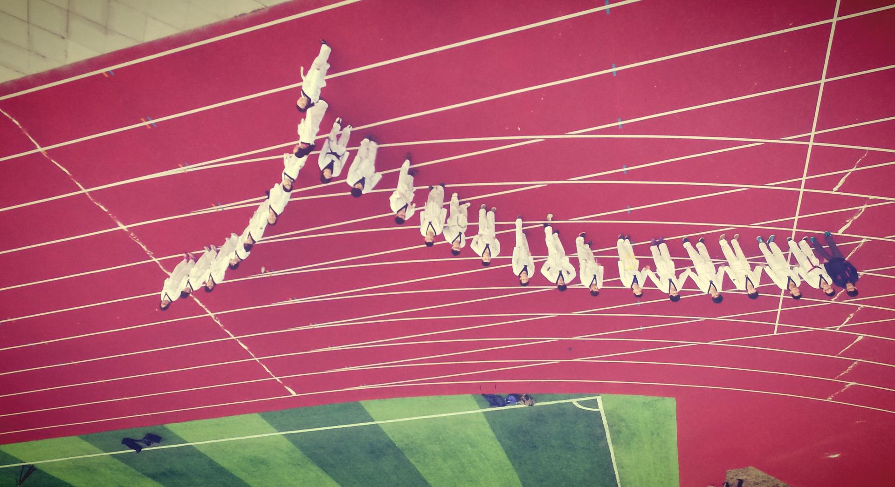

跆拳道精神为：礼义廉耻，忍耐克己，百折不屈。

我们秉着以武会友、以人为本、来去自由的宗旨。

希望跆拳道高手来汇合，使我们后继有人。

热烈欢迎有韧性的体育爱好者前来体验，并可增强力量、速度、柔韧与协调性。

每周由专业黑带教练于体育馆专用场地带领进行训练。

### ACM社

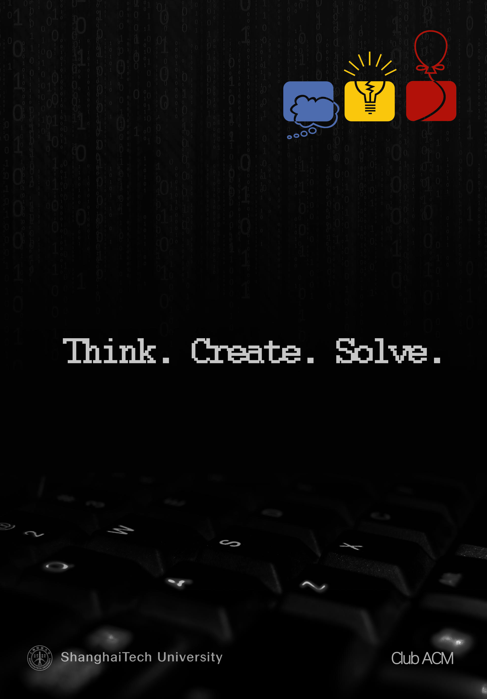

社长很懒，什么字都没写。

## 学生组织

### 上海科技大学学生会

全称：上海科技大学学生联合会（ShanghaiTech Student Union）

宗旨：为学生服务

学生会邮箱：[studentunion@shanghaitech.edu.cn](mileto://studentunion@shanghaitech.edu.cn)

#### 基本架构

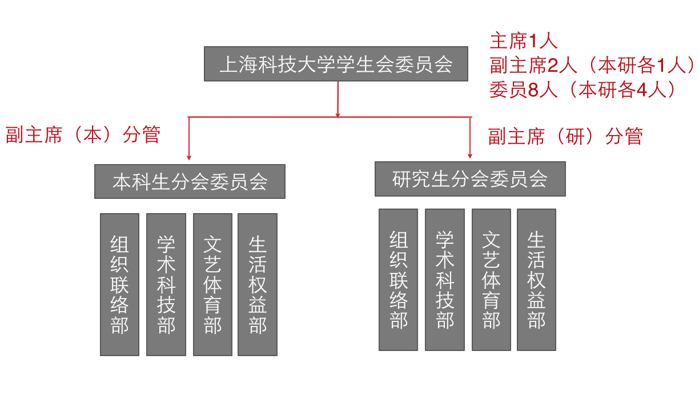

#### 主席团成员

学生会主席：张凡（研究生）

本科生分会副主席：郑纬彤（本科生）

研究生分会副主席：张凡（研究生）

组织联络部部长：吴秉瀚（本科生）

学术科技部部长：吕文涛（本科生）　梁庄典（研究生）

文艺体育部部长：吴凌霜（本科生）　王　栋（研究生）

生活权益部部长：王娇娇（本科生）

#### 部门介绍

##### 组织联络部

组织联络部常设日常事务管理、学生会宣传、外联、社团管理、记录档案考勤等多项职能，如遇全校活动，更是义不容辞。综办的风格就是干练&高效，如果你认为自己执行能力很强，如果你认为自己在宣传上有一技之长，如果你对外联很感兴趣，如果你有志引导科大社团走向繁荣，就请加入组织联络部！

##### 学术科技部

学术科技部主要为学习与科学研究方面服务于同学的部门。工作内容主要包括组织各类大中小型讲座，建立健全完善的校内信息发布与收集平台，营造良好学习氛围，举办或组织同学参加各类学术竞赛活动等。

##### 文艺体育部

文艺体育部，是负责上海科技大学本科生、研究生及全校教职员工的文化艺术活动与体育健康活动的专门职能部门。部门主要以丰富大学生校园文化生活、陶冶大学生文化艺术情操、培养大学生对各项体育活的热情以及与校内各社团和与其他高校文体部共同开展文化艺术体育方面的活动为目的来开展工作。

##### 生活权益部

生活权益部是学校和同学间沟通的桥梁。主要工作为解决同学们在学校生活中可能遇到的各种问题，集中反映，集中解决，为保障学生生活而不懈努力；开展和生活相关的各类活动，如传统美食制作，每周六晚免费提供水果和桌游的相约周末等，不定期举办学生交流会，为同学们直接和校方面对面沟通架起桥梁。

### 上海科技大学学生会－礼仪队

#### 成立初衷

上海科技大学作为一所小规模、高水平、国际化的科技大学，在日常或是正规活动中都非常需要一支具有上海科技大学风格的礼仪队来承担有关的接待工作。女生的美靠气质，我们希望礼仪队能够帮助我们学校非常聪慧的女孩子们在气质上也与众不同。所以首先招募了女生们加入礼仪队，并进行了一些最基础的培训～礼仪队成立周年后，我们发现男生礼仪队也是我们学校不可缺少的风景线～男女礼仪队在第二年中的表现更是有了新的突破～作为礼仪队的成员，我们希望能够在任何时候都代表着上科大出色的形象～

#### 展望

就如成立之初我们所希冀的那样，我们希望最终礼仪队会是具有上海科技大学特色的队伍～为此，我们希望能够在日常的训练中多下功夫；在团队形象的设计上再别出心裁一些；在安排活动接待、引导等工作时多开脑洞，想出一些特别的方式～让大家一眼就能认出这是上海科技大学的礼仪队～

我们欢迎上海科技大学的每一位同学来参与礼仪队，为共建上科大美好的学生形象努力～

### 上海科技大学学生会－VOT广播站

#### 成立初衷

广播站作为传统中国大学文化中不可或缺的一部分，肯定也应该出现在上科大的校园中。而上海科技大学作为一所小规模、高水平、国际化的科技大学，其广播站也应当是充满创新精神的。我们希望通过这样一个平台真正平等的传达学校和同学们的声音，用样也通过这个平台给同学们的生活带来更多色彩，为此我们引入了网络平台直播等功能，极大的丰富了广播站的功能，来为同学们带来更好的体验。

#### 展望

就如成立之初我们所希冀的那样，我们希望最终广播站会成为上海科技大学学生的生活中的一个非常重要的伴侣，为此，我们不仅仅将在技术方面做更多的努力来提高收听体验，更会在内容方面多下功夫，在达成平等自由传达信息的目标后，更要成为科大校园流行文化的重要源头之一。我们是低调的VOT广播站，我们这里的大门永远敞开着。

### 上海科技大学学生团支部（筹）

学生团支部正在筹建过程中，主要以楼层为基层组织单位，与学生会密切配合，开展各类组织生活。

## 校园地图

身为上科大的学子，倘若在校内迷路岂不是一件非常丢人的事情呢~牢记学校的建筑布局和标准命名，有助于各位路痴们迷失在校园的时候呼唤警察叔叔哦。

## 食

### 校园餐饮服务

* 新校区食堂：截止至2016年夏季学期结束，食堂共设三个窗口，分别为面食窗口（面条和水饺馄饨）、自主选餐窗口和10元套餐窗口。使用校园一卡通，不接受现金。

* 海科路校区食堂：位于行政楼一楼和二楼。二楼主要提供港式套餐、商务套餐和香锅。使用中国科学院上海高等研究院餐卡，接受现金。

* 高等研究院食堂：一楼有套餐和兰州拉面，二楼有商务套餐和鸭血粉丝汤，使用中国科学院上海高等研究院餐卡，不接受现金。（内设小超市，卖零食和水果等。使用中国科学院上海高等研究院餐卡，接受现金，支付宝）

### 便利店与外卖

* 全家：新校区与海科路校区各有一家全家便利店，可现金、支付宝、微信、银行卡、Apple Pay 等，支持使用学校一卡通。

* 罗森：新校区东门（中科路1号）出门直行至公司大楼门口右拐右拐走到底左拐再左拐。支持现金、支付宝。

* 外卖：外卖大部分送达时间为 30 分钟到 70 分钟，学校有外卖红包分享的微信群。大多数同学选择饿了么，但请注意饮食卫生安全。

## 乐

（然而作业那么多怎么出去浪【怨念脸）

* 长泰广场：金科路2889号，从环科路199号门口乘坐1057路公交车至祖冲之路金科路站下车即达，位于2号线金科路站4号口。从地下到地上三层均有觅食处。地下拥有两个美食城，多为简餐、饮品店，偏中低端消费，人均50-100；地上为中高端消费，人均价格和海拔基本成正比，基本在100以上；地上也包括许多购物商店、酒吧，还有中影长泰国际影城。

* 汇智商业中心：金科路3057号，长泰广场对面。拥有颇多购物消费地点，1楼的药房，地下的欧尚超市。汇智内全楼层均有不少可以觅食的地点，一楼和五楼极佳，五楼有上影河马国际影城。

* 传奇广场：碧波路635号，沿科苑路直行3公里即达，或在金科路中科路公交站搭乘浦东25路，张江高科下车，站点紧挨着传奇广场；位于2号线张江高科站5号口对面，是一个老牌的商业广场，以美食与小吃为主，但是与上两者相比，规模较小，且娱乐功能偏少。

* 宜家北蔡商场：在学校附近乘坐南川线即可到达，周二会员日主食半价，人均消费 30 到 50 元。

* 大拇指广场：满足口腹之欲的好地方。

## 住

目前而言，热水、网络、电全天候供应。男女生分居同层两侧，中间有"天堂之门"隔开，晚10时关闭，早10时开启。

宿舍一般是三人间，上床下桌，基本为全实木家具。身高过高的同学有几率可以分到两人间。宿舍内部带淋浴设施，有洗漱台盆。半封闭阳台上安置了晾衣杆，需要注意的是风雨天气需要及时收衣服，以免淋湿甚至吹落。

冰箱位于学生公寓底楼，由物业定期清理过期食品。电吹风、微波炉请在活动室使用，严禁在活动室以外使用电吹风。再次强调寝室内严禁使用电吹风、电暖器、冰箱等违禁电器。学生公寓底楼亦设有收费洗衣机、烘干机、自动售货机等设备。

上科大学生宿舍严禁留宿非本校人员，出租床位、借床位朋友过夜等行为都是严重违反学生公寓管理规定的，一旦发现，轻则严重警告，重则记过处分。

在校园内有同学与公共服务处一起设立的流浪动物收容点，请勿将宠物诱拐入学生公寓内，以照顾过敏体质的同学并防止宠物在各种公共设施上爬来爬去，留下排泄物。

书院底楼地面为地毯，尽量避免在书院底楼饮用有色饮料或含糖饮料，一旦翻在地上会给保洁阿姨带来很大的麻烦。

## 行

学校地处张江高科技园区核心区·中区，东临金科路，南抵华夏中路，西至集慧路，北接海科路。在建中轨道交通13号线经过校园，并在东门外设有中科路站。

### 校内交通

在海科路过渡校区继续启用期间，开设海科路校区—新校区短驳班车。时刻表见：[http://public.zhouzean.tk/bus/](http://public.zhouzean.tk/bus/)

学校目前的岳阳路—张江校区班车主要对教职员工与研究生服务。

开学后公共服务处会联系自行车厂商来学校，届时大家也可以选购自己心仪的自行车作为大学期间的交通工具，同时还可以骑着自己的小车参加城市定向社精彩的活动。另有电动车充电桩和自行车出租服务。

### 校外交通

目前学校沟通校外的交通出行主要仰赖1057路公交车，其起讫站——环科路金科路站在学校东南门外。1057路途径复旦张江校区，上行终点为金科路地铁站，在2号线金科路站3号口外，单程票价为1元（若使用公交卡在一定时间前后乘坐过地铁，可免去1元）。抵达金科路地铁站后，稍作停留即再次途径复旦张江校区回到上科大。时刻表见：[http://public.zhouzean.tk/bus/](http://public.zhouzean.tk/bus/)

此外，可选公交浦东25路，与学校较近站点为中科路金科路站，上行终点张江高科地铁站，当你绝望地看着1057弃你而去时，浦东25或许正静静地等待着你，班次时刻表可见于站牌公示。

推荐使用一款名为"上海公交"的APP，可以查询实时公交情况，为出行做好充分的准备。

双休日学校班车亦有部分班次抵达地铁站。

海科路校区正对面的中科院上海高等研究院与我们学校可以说是心连心、同呼吸、共命运。他们往返于海科路与张江高科地铁站的班车大家完全可以放心乘坐，终点站位于高研院内。时刻表见：[http://public.zhouzean.tk/saribus/](http://public.zhouzean.tk/saribus/)

### 上海公共交通卡

官方网站：[上海公共交通卡](http://www.sptcc.com/index.html)

需要办理上海公共交通卡的同学可以前往上海各大地铁站的服务中心办理，押金20元，退卡时退还余额和押金（不是所有服务中心都可以办理退卡业务，余额大于10元时需扣去1%的服务费），可用于：全上海的巴士服务，轨道交通服务，出租车和摆渡服务（磁悬浮需另购票）。

紫色交通卡（即现在办理统一发放的交通卡）也可适用于以下城市的公共交通服务：太仓、金华、宜兴、宁波、绍兴、湖州、台州、常熟、昆山、江阴、淮安、启东、无锡、南通、泰州、长兴、舟山。

公共交通卡在使用后的两小时内换乘其他公共交通服务（但地铁出站后再次进站乘坐不享受优惠）时可享受折扣，折扣1元起（如你从地铁下来之后2小时内乘坐1057，用交通卡的话就是免费）。

交通卡充值：可前往所有的地铁服务中心，地铁站内终端机（支持支付宝和银联卡），部分便利店（校内没有）。

建议给交通卡做上特殊标记，以免乘坐出租车时被出租司机掉包。

### 出租车

上海市市区出租车价格：

* 起步价14元（含3千米或15分钟等候）

* 行驶里程在3千米至15千米的部分，每千米2.5元

* 行驶里程超出15千米后，每千米3.8元

* 低速行驶时，每4分钟记1千米

* 夜间（每日23:00至次日5:00）行驶加收30%夜间费

### 非市区沪牌限行

郊县出租车（沪C牌照）价格除起步价为12元外，与市区出租车基本相同，但不得驶入市区范围（浦西外环线以内，浦东部分城区）。我校浦东校区不处于沪C牌照限行区域。下图为沪C车牌限行范围（包含红线道路）：

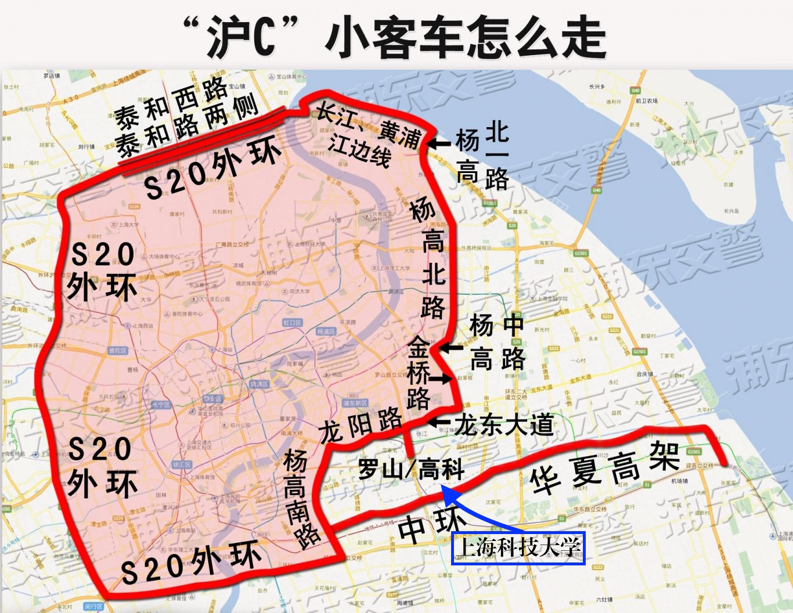

## 服务网点

### 购物

校内有两家全家超市，可以满足大部分生活需求。其中近宿舍区的全家超市是24小时营业店。

### 邮政

校园内设有小麦公社与京东派京东自提点。小麦公社代收中国邮政以及大部分主流快递商的快递。校内地址格式：

上海市浦东新区华夏中路393号学生公寓×号楼×××室×××收

邮政编码：201210

需要注意的是，小麦公社和京东派内的快件逾期未领将被退回。**今年不接受正式开学前的邮递行李**，若有需要邮递的行李，请在9月正式开学前后寄来。

### 医疗

张江校区到上海中医药大学附属曙光医院（东院）仅2公里，可乘坐1057到达。危急情况下，若身体严重不适，请及时与宿管联系，以安排车辆前往医院。

关于医疗保险等细节问题，请参阅[上海科技大学大学生就诊服务指南](http://openinfo.shanghaitech.edu.cn/service/20151021/49.html)。

### 运动

体育馆内目前开放健身房等设施。羽毛球场、舞蹈房等需要预约。

## 安全

* 无论何时何地，同学们都需要注意自身安全。

* 理论上说不要穿越工地，尤其不要去折腾正在施工中的设施哦。

* 河边戏水有危险！

* 大学不同于中学的封闭性，校园内会有很多校外人员出入，所以一定要注意保管好自己的财物。来跟我一起大声念出来：不要用手机、电脑、钱包（带钱带证的）、男女朋友（说的好像我们都有一样）等贵重物品占座！

* 你们将在军训的时候见到一个发熊的警察怪蜀黍，他就是上海公安高校派出所的民警，他会加进本科生群，一旦发现什么风吹草动等可疑的事情发生，请及时联系他。

* 宿舍内不允许使用电饭锅，电磁炉，电吹风，电热器等一系列大功率用电设施，具体内容可以翻阅学生手册。由于我们的宿舍装修从床到地板皆为木制结构，为了自己和他人的安全，请不要怀有侥幸心理。

* 周边外卖时有传出腹泻，急性肠胃炎等新闻，所以点外卖前请尽量三思。

* 偶尔会有校外人员混进宿舍楼，假装自己是大四学长学姐，这种时候请不要犹豫直接叫保安（开玩笑呢，最高年级才大三），如遇其他可疑人员也请及时通知宿管和保安，毕竟活动室的微波炉要被搬走了晚上还怎么叮泡面。

* 有的实验真的会发生爆炸，所以严格遵守实验规程！严格遵守实验规程！严格遵守实验规程！

（负责写这部分的学长似乎很喜欢卖萌=￣ω￣=）

# 常用信息

## 学校部门

### 与学生密切相关的部门

* 学生事务处/书院：党团事务、本科生事务、科创与拓展中心、文化与学术中心、心灵与健康中心、管理与发展中心、艺术与体育中心；[mailto:life@shanghaitech.edu.cn](mailto:life@shanghaitech.edu.cn)

* 教学事务处：教务、课程运行、教学评估、招生、奖助、学籍、学业证明、培养方案；[mailto:asa@shanghaitech.edu.cn](mailto:asa@shanghaitech.edu.cn)

* 公共服务处：园区物业、食堂、班车、生活证明、校园一卡通、医疗保险；[mailto:ogs@shanghaitech.edu.cn](mailto:ogs@shanghaitech.edu.cn)

* 图书信息中心：图书馆、数据库、软件正版化、信息基础建设、文印设施与服务；

    * 图书馆：[mailto:library@shanghaitech.edu.cn](mailto:library@shanghaitech.edu.cn)

    * 信息中心：[mailto:it@shanghaitech.edu.cn](mailto:it@shanghaitech.edu.cn)

### 学生不太接触的部门

党委办公室、校长办公室、科技发展处、国际合作处、人力资源处、财务处、基建管理中心、设备与资产处

## 常用网站

### 校内常用网站

上科大官方以及诸多同学和社团都开办了很多网站服务，从基本的校园信息查询到学术交流，再到学生社交，全方位为大家提供丰富的在线体验。

* 学校官网：[http://www.shanghaitech.edu.cn](http://www.shanghaitech.edu.cn)

* 学校邮箱：[http://mail.shanghaitech.edu.cn](http://mail.shanghaitech.edu.cn)

* 教学事务处与学生事务处：[http://asa.shanghaitech.edu.cn](http://asa.shanghaitech.edu.cn)

* 信息公开网：[http://openinfo.shanghaitech.edu.cn](http://openinfo.shanghaitech.edu.cn/)

* 活动成就签到系统：[https://grade.geekpie.org](https://grade.geekpie.org)

* CourseBench 评课社区：[https://www.coursebench.net](https://www.coursebench.net)

* 开源镜像站：[https://mirrors.geekpie.org](https://mirrors.geekpie.org)

* WikiShanghaitech（维护中）：[https://wiki.geekpie.org](https://wiki.geekpie.org)

* 陈浩爸爸的教学服务器：[https://shtech.org](https://shtech.org)

* eMotiV Studio（学生微电影工作室，关闭维护中）：[www.emotivstudio.org](http://www.emotivstudio.org)

* GeekPie社团：[www.geekpie.org](http://www.geekpie.org)

* 则安的小站（动态班车时刻表 & 常用软件下载）：[http://public.zhouzean.tk](http://public.zhouzean.tk)

### 常用站点

* Google [https://www.google.com/](https://www.google.com/)

* Wikipedia [https://www.wikipedia.org/](https://www.wikipedia.org/)

* Coursera [https://www.coursera.org/](https://www.coursera.org/)

* Piazza [https://piazza.com/](https://piazza.com/)

* LinkedIn [https://www.linkedin.com/](https://www.linkedin.com/)

* YouTube [https://www.youtube.com/](https://www.youtube.com/)

* StackOverFlow [http://stackoverflow.com/](http://stackoverflow.com/)

* AllAboutCircuits [http://www.allaboutcircuits.com/](http://www.allaboutcircuits.com/)

* 网易公开课 [http://open.163.com/](http://open.163.com/)

* 中国知网 [http://www.cnki.net/](http://www.cnki.net/)

* WolframAlpha [https://www.wolframalpha.com/](https://www.wolframalpha.com/)

* GitHub [https://github.com/](https://github.com/)

* 图书馆电子数据库目录 [http://library.shanghaitech.edu.cn/library_resource/3.html](http://library.shanghaitech.edu.cn/library_resource/3.html)

（以上部分网站需要科学上网技巧，请联系信院爸爸们提供服务）

## 生活类群

* 上海科技大学小麦公社QQ群 125075196

* 上科大深夜外卖报社群（分享饿了么红包、滴滴打车红包、大众点评红包等）

* 京东上海科技大学优惠群（向京东快递员询问即可加入）

## 技巧经验

### 校园邮箱各客户端配置指南

邮箱客户端的初次同步耗时一般都不短，需要耐心等待。

为安全起见，学校邮箱有密码错误登录次数限制，多次输错密码会被后台锁定，在配置邮箱的时候需要尤为注意，小心手抖哦。

推荐同学们在假期学习一下邮件书写格式，以及养成定期查阅邮箱的好习惯。上科大的日常信息大多通过邮件形式推送，日常与教授之间的交流更多的也是邮件的形式，今后走上工作岗位也用处颇多。望各位同学利用好这一资源。

#### Android / iOS

添加校园邮箱账户的流程类似，首先进入相应的配置页面。

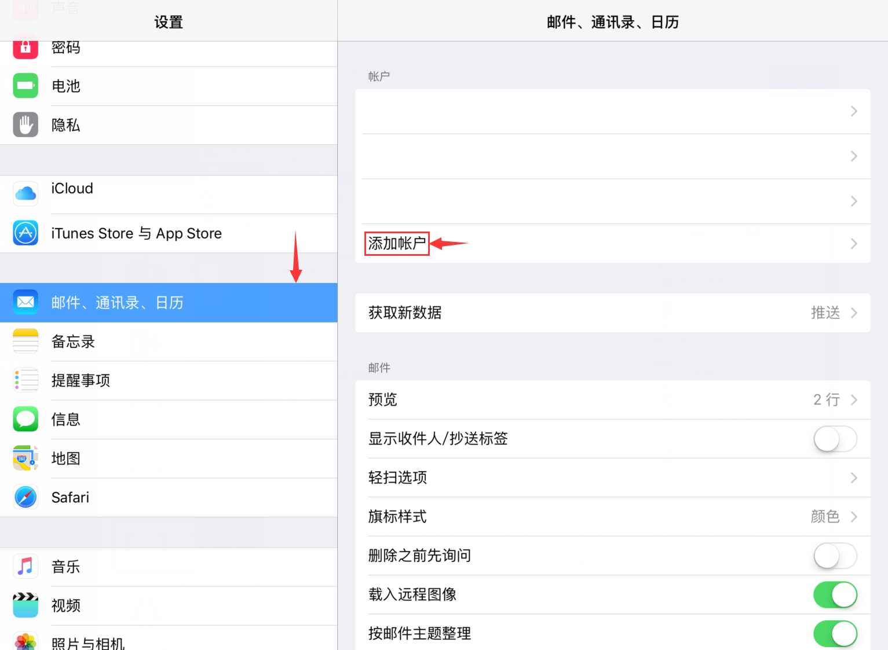

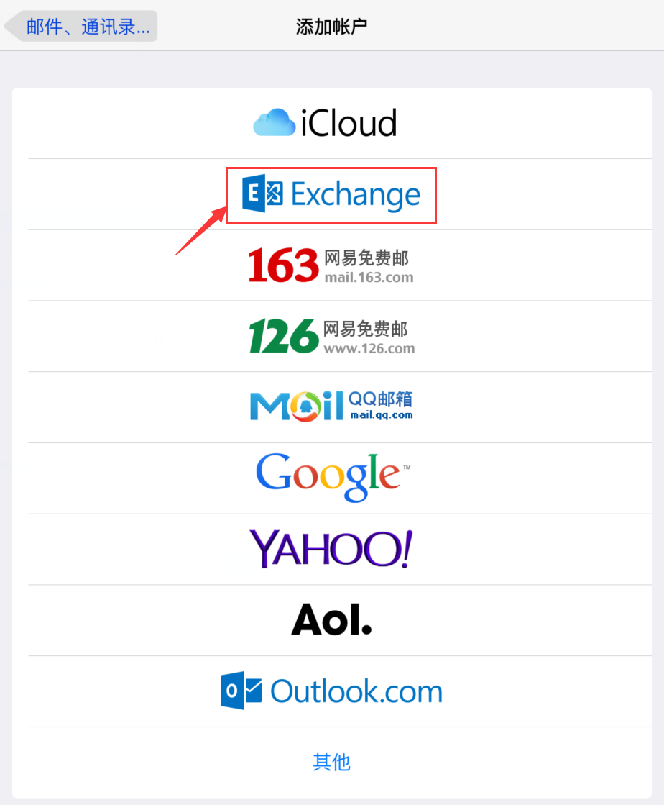

#### macOS

直接前往"系统偏好设置"中的“互联网账户”添加。

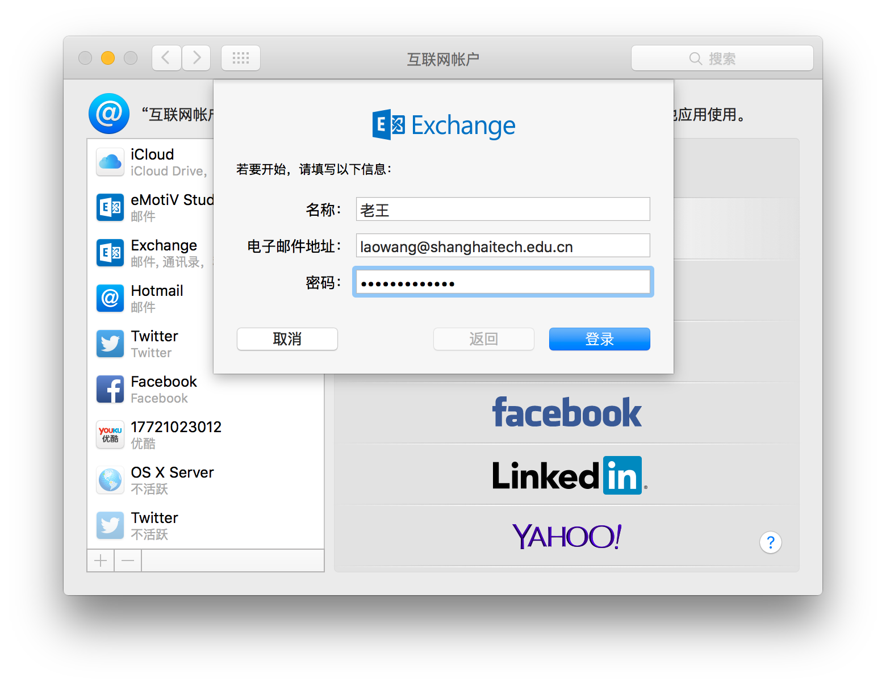

#### Windows

如果你使用 Outlook，那么就享受傻瓜式的邮箱使用吧！

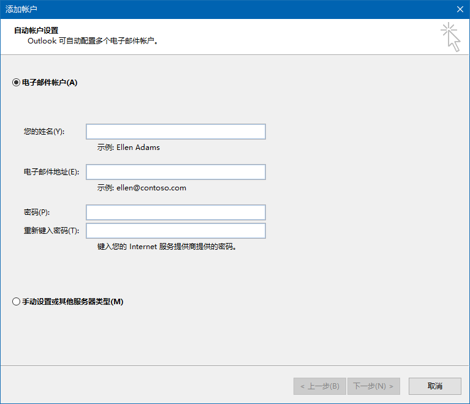

如果使用 Windows 自带的邮件应用，请按如下方式操作，不让将会遇到证书权限的问题：

#### Linux

以Ubuntu系统为例，Thunderbird Email为系统默认的邮件软件。在Edit选项页中选择Account Settings，在左侧竖框下方的Accout Actions下拉菜单中选择Add Mail Accout，填写好自己的邮箱地址、密码之后continue，程序会自动搜索配置剩余内容，傻瓜程度与Outlook无异。

### 校园VPN使用指南

请参阅[电子资源校外访问指南](http://library.shanghaitech.edu.cn/library_mission/20160411/160.html)。

# 特典

## 问答

## 关于

上海科技大学 新生手册

技术支持：上海科技大学学生Geek Pie社团

主办：上海科技大学 学生会

[Github](https://github.com/ShanghaitechGeekPie/fresh)

### 贡献者

#### Content

感谢以下同学参与本新生手册的撰写工作（排名不分先后，也遗漏了许多不留名的红领巾）

吕文涛　　郑纬彤　　石嘉禾　　赵尚书　　林东吴

王娇娇　　吉星宇　　刘心哲　　陶之钰　　张　尧

陈益帆　　宗　骏　　崔振宇　　邵乾瀚　　陈　宸

周则安　　周胡蝶　　丁　鹏　　刘宇翔　　林子恒

李振扬　　赵亚妮　　覃　昕　　谢佳轩　　袁蕴哲

王粱宇　　李俊蓉　　张崔政　　荣宇阳　　张嘉鑫

李鼎弘　　李逸柯

#### Program

吕文涛

#### Photography

黄政嘉　　刘　勋　　毕　凝

#### Acknowledgement

[浙江大学 求是潮](https://tech.zjuqsc.com/)
